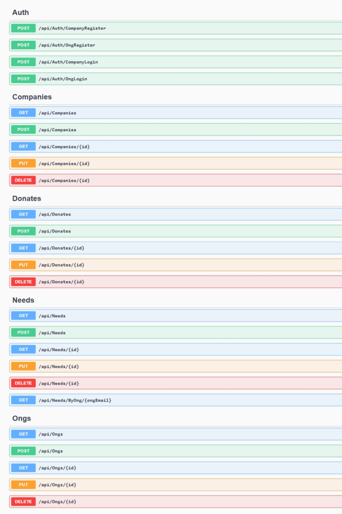
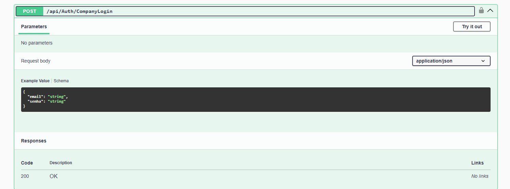
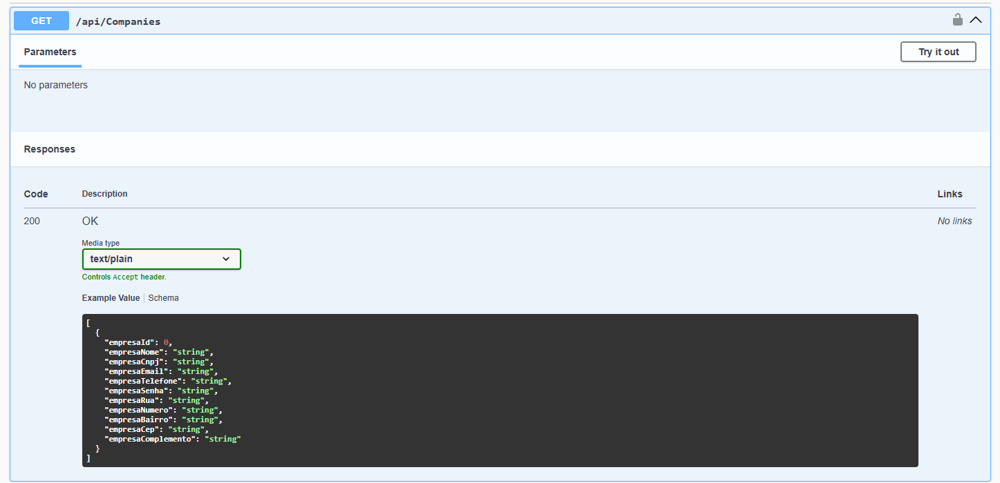
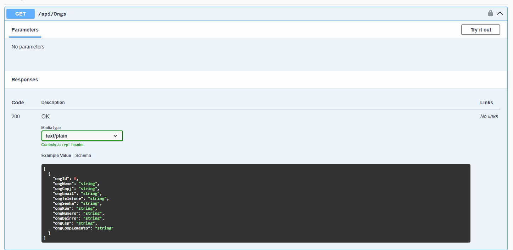
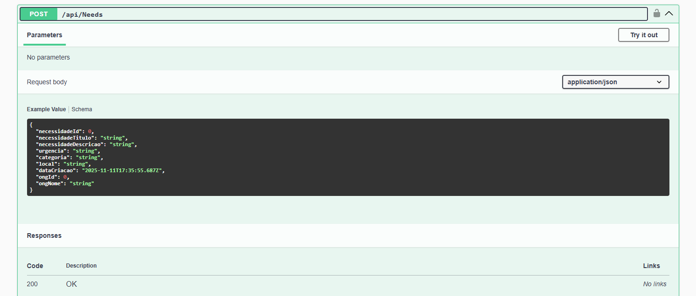
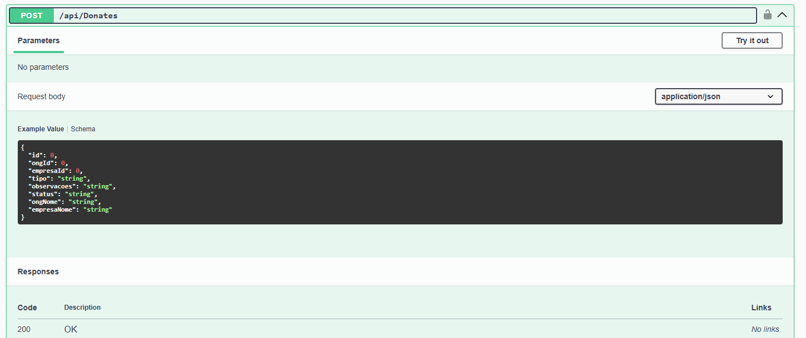
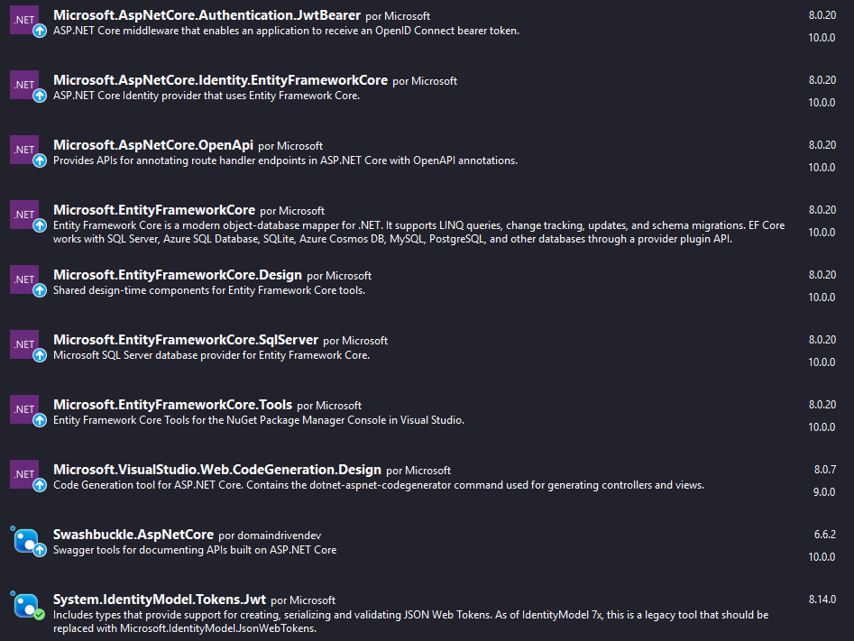

<div align="center">
<h1>GlobalLink API</h1>


</div>

<a href="/docs/DocumentacaoAPI.pdf">Documentação Técnica</a>

# 📌 Índice

- [Lista de EndPoints](#lista-de-endpoints)
- [Resultados esperados pelos EndPoints](#resultados-esperados-pelos-endpoints)
- [Instalação](#instalação)
    - [Pré-requisitos](#pré-requisitos)
  - [Instalação](#instalação)

<h1>Lista de EndPoints</h1>



<h1>Resultados esperados pelos EndPoints</h1>

### (Em formato JSON)

## Cadastro de Empresas ou ONGs (POST)


## Login de Empresas ou ONGs (POST)




## Dados de Empresas e ONGs (GET)





## Doações e Necessidades (POST)





<hr>

<h1>Instalação</h1>

## Pré-requisitos

- .NET 8.0
- Pacotes NuGet (Versão referente ao .NET) <br>


<h1>Instalação</h1>

```bash
# Clone o repositório
https://github.com/JoaoFCosta/GlobalLinkAPI.git

# Execute o comando no Terminal
dotnet Run
